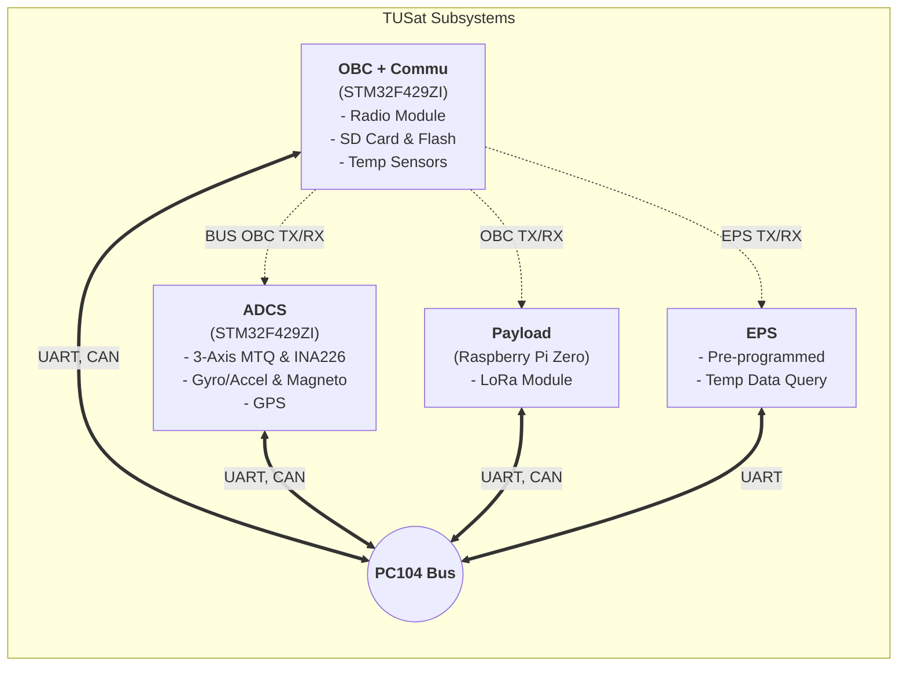

# TUSat Documents
## Welcome to TUSat Documents
This document will explain a brief overview of TUSat subsystem operation and functions

The satellite consists of 4 main subsystems:

1. [**OBC + Commu**](subsystems/obc-commu.md): On-Board Computer with SD card, flash memory, temperature sensor, and communication module (Radio RFM98PW).
2. [**ADCS**](subsystems/adcs.md): Attitude Determination and Control System featuring 3-axis MTQ with PWM and direction control. Each MTQ's current and voltage are monitored through an INA226 sensor. It also includes an external gyro/accelerometer, a magnetometer board, and a GPS.
3. [**EPS**](subsystems/eps.md): Electrical Power System, which is pre-programmed and can be queried for temperature data.
4. [**Payload**](subsystems/payload.md): Payload subsystem utilizing a Raspberry Pi Zero and a LoRa module.

### Overall System Architecture

