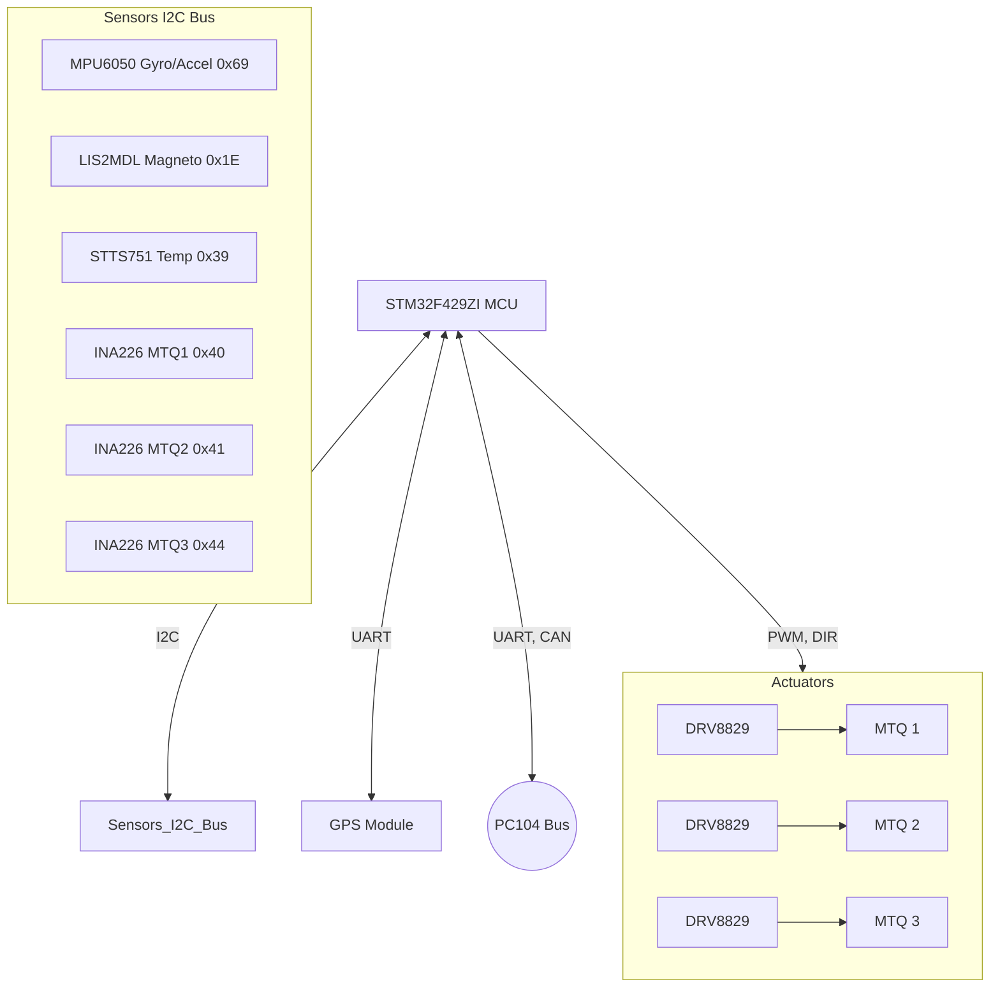

# Attitude Determination and Control System (ADCS)

## Overview
The ADCS subsystem determines the satellite's orientation (attitude) in space and applies control torques to stabilize it or point it in a desired direction (e.g., pointing antennas at Earth or solar panels at the sun).

## Core Components
- **Microcontroller (MCU)**: STM32F429ZI

## Sensors (Attitude Determination)

- **Gyroscope & Accelerometer (MPU6050)**:
  - **Duty**: Measures the satellite's angular velocity and linear acceleration.
  - **Interface/Protocol**: I2C (Address: `0x69`).
- **Magnetometer (LIS2MDL)**:
  - **Duty**: Measures the Earth's magnetic field vector to help determine the satellite's orientation relative to Earth.
  - **Interface/Protocol**: I2C (Address: `0x1E`).
- **GPS**:
  - **Duty**: Provides precise position, velocity, and time data.
  - **Interface/Protocol**: UART (TX/RX).
- **Temperature Sensor (STTS751)**:
  - **Duty**: Monitors ADCS board temperature.
  - **Interface/Protocol**: I2C (Address: `0x39`).

## Actuators (Attitude Control)

- **Magnetic Torquers (MTQ 1-3)**:
  - **Duty**: Coils that generate a magnetic dipole moment, interacting with the Earth's magnetic field to produce torque and rotate the satellite.
  - **Control Method**: Driven by **DRV8829** stepper/DC motor drivers. Controlled via **PWM** (for strength) and **DIR** (direction/polarity) pins from the MCU.
- **Voltage/Current Sensors (INA226 x3)**:
  - **Duty**: Monitors the power consumption and health of each MTQ.
  - **Interface/Protocol**: I2C (Addresses: `0x40`, `0x41`, `0x44`).

## Internal Communication & Storage
- **SPI Flash (W25Q128)**: For storing configuration and control logs via SPI.
- **CAN Transceiver (SN65HVD230)**: Connects to the PC104 CAN bus.
- **PC104 Bus**: Communicates with the OBC via UART and CAN.

## Architecture Diagram

### Detailed Pinout Diagram

