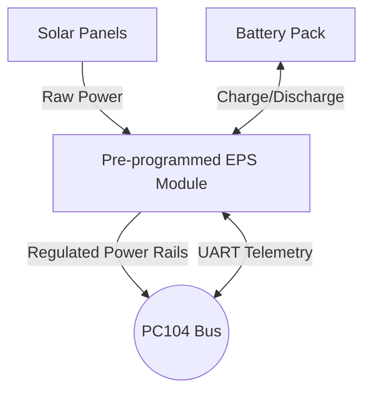

# Electrical Power System (EPS)

## Overview
The Electrical Power System (EPS) is a critical infrastructure component that manages the generation, storage, and distribution of power to all other satellite subsystems. In TUSat, the EPS relies on a pre-programmed PC104 module.

## Duty in the CubeSat
- **Power Generation**: Interfaces with solar panels to harvest solar energy.
- **Power Storage**: Manages battery charging and discharging to ensure continuous power during eclipse phases.
- **Power Distribution**: Provides regulated voltage rails (e.g., 3.3V, 5V) to the PC104 bus for the OBC, ADCS, and Payload to consume.
- **Protection & Monitoring**: Safeguards against over-current and over-voltage scenarios, while providing telemetry (like temperature and voltage levels) back to the OBC.

## Sensors and Actuators
Because the module is pre-programmed, internal component details are abstracted. However, it exposes a specific sensor interface:
- **Temperature & Health Monitoring**: The EPS can be queried by the OBC to retrieve critical health telemetry, such as current temperature, battery charge level, and rail voltages.

## Communication Method
- **Interface/Protocol**: UART (EPS TX, EPS RX). The OBC sends query commands via UART over the PC104 bus, and the EPS responds with the requested telemetry data.

## Protocol Description

| Field      | Description                               | Value                   |
| ---------- | ----------------------------------------- | ----------------------- |
| **FSTART** | Frame Start Flag                          | `0xC0 0x00`             |
| **CMD**    | Command (What you want to do)             | See command table below |
| **PARAM**  | Extra info (like channel number or state) | Depends on command      |
| **FEND**   | Frame End Flag                            | `0xC0`                  |

---

### Commands Summary

| Command Name       | CMD Value | PARAM                        | Description                                                |
| ------------------ | --------- | ---------------------------- | ---------------------------------------------------------- |
| `EPS_CMD_NONE`     | `0x00`    | -                            | Do nothing (reserved)                                      |
| `EPS_GET_INA226`   | `0x01`    | Channel (0–7)                | Read voltage/current from INA226 sensor (Solar or Battery) |
| `EPS_GET_ADM1177`  | `0x02`    | Channel (0–5)                | Read voltage/current from output channel                   |
| `EPS_GET_OUTPUT`   | `0x03`    | Channel (0–5)                | Get ON/OFF state of output channel                         |
| `EPS_GET_TEMP_BAT` | `0x04`    | Channel (0-1)                | Read battery temperature sensors                           |
| `EPS_SET_OUTPUT`   | `0x05`    | Channel, State (0=OFF, 1=ON) | Turn output channel ON or OFF                              |
| `EPS_SENSOR_INIT`  | `0xFE`    | -                            | Re-initialize all sensors                                  |
| `EPS_GET_PARAM`    | `0xFF`    | -                            | Get configuration parameters                               |

---

### Example Commands

| Action                            | Full Command Frame  |
| --------------------------------- | ------------------- |
| **Read Solar Panel CH1 (INA226)** | `C0 00 01 00 C0`    |
| **Turn ON Output Channel 2**      | `C0 00 05 02 01 C0` |
| **Read Battery Temp**             | `C0 00 04 00 C0`    |

---

### Tips

* All commands **must start with `0xC0 0x00`** and end with **`0xC0`**
* Always double-check **channel numbers** when sending commands
* You can use a **serial terminal** or script to send frames

## Architecture Diagram

```mermaid
flowchart TD
    EPS[Pre-programmed EPS Module]
    
    Solar[Solar Panels] -->|Raw Power| EPS
    Battery[Battery Pack] <-->|Charge/Discharge| EPS
    
    PC104((PC104 Bus))
    
    EPS -->|Regulated Power Rails| PC104
    EPS <-->|UART Telemetry| PC104
```

### Detailed Pinout Diagram

