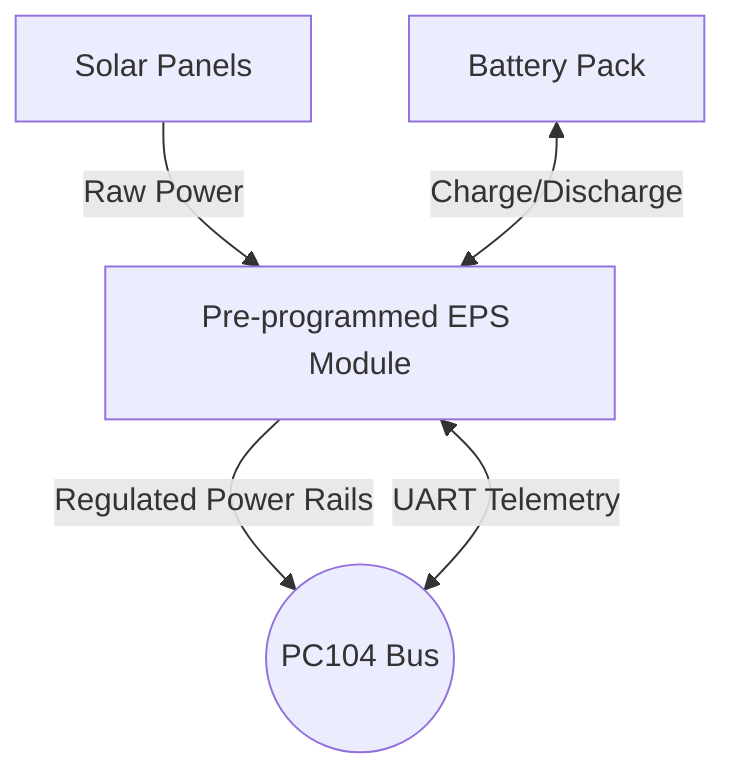

# Electrical Power System (EPS)

## Overview
The Electrical Power System (EPS) is a critical infrastructure component that manages the generation, storage, and distribution of power to all other satellite subsystems. In TUSat, the EPS relies on a pre-programmed PC104 module.

## Duty in the CubeSat
- **Power Generation**: Interfaces with solar panels to harvest solar energy.
- **Power Storage**: Manages battery charging and discharging to ensure continuous power during eclipse phases.
- **Power Distribution**: Provides regulated voltage rails (e.g., 3.3V, 5V) to the PC104 bus for the OBC, ADCS, and Payload to consume.
- **Protection & Monitoring**: Safeguards against over-current and over-voltage scenarios, while providing telemetry (like temperature and voltage levels) back to the OBC.

## Sensors and Actuators
Because the module is pre-programmed, internal component details are abstracted. However, it exposes a specific sensor interface:
- **Temperature & Health Monitoring**: The EPS can be queried by the OBC to retrieve critical health telemetry, such as current temperature, battery charge level, and rail voltages.

## Communication Method
- **Interface/Protocol**: UART (EPS TX, EPS RX). The OBC sends query commands via UART over the PC104 bus, and the EPS responds with the requested telemetry data.

## Architecture Diagram

```mermaid
flowchart TD
    EPS[Pre-programmed EPS Module]
    
    Solar[Solar Panels] -->|Raw Power| EPS
    Battery[Battery Pack] <-->|Charge/Discharge| EPS
    
    PC104((PC104 Bus))
    
    EPS -->|Regulated Power Rails| PC104
    EPS <-->|UART Telemetry| PC104
```

### Detailed Pinout Diagram

