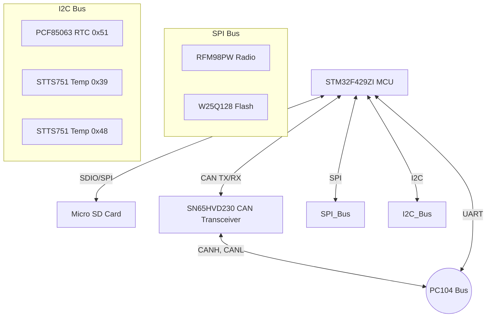

# OBC + Commu Subsystem

## Overview
The On-Board Computer (OBC) and Communication (Commu) subsystem acts as the "brain" of the CubeSat. It is responsible for overall satellite management, scheduling tasks, handling telemetry and telecommands, monitoring system health, and communicating with the ground station.

## Core Components
- **Microcontroller (MCU)**: STM32F429ZI

## Sensors and Modules

### Communication
- **Radio Module (RFM98PW)**: 
  - **Duty**: Primary transceiver for sending telemetry to and receiving telecommands from the ground station.
  - **Interface/Protocol**: SPI (MISO, MOSI, SCK, NSS) along with GPIOs for interrupts (D0-D4) and Reset.

### Storage
- **Micro SD Card**:
  - **Duty**: High-capacity data logging for telemetry and payload data.
  - **Interface/Protocol**: SDIO / SPI (CMD, CLK, DAT0, CD/DAT3).
- **SPI Flash (W25Q128)**:
  - **Duty**: Reliable persistent storage for bootloader, configuration, and critical logs.
  - **Interface/Protocol**: SPI.

### Time & Health Monitoring
- **Real-Time Clock (PCF85063)**:
  - **Duty**: Keeps accurate time for timestamping data and scheduling operations.
  - **Interface/Protocol**: I2C (Address: `0x51`).
- **Temperature Sensors (STTS751 x2)**:
  - **Duty**: Monitors the thermal health of the OBC and Commu boards.
  - **Interface/Protocol**: I2C (Addresses: `0x39` and `0x48`).

### Internal Bus Communication
- **CAN Transceiver (SN65HVD230)**:
  - **Duty**: Interfaces the MCU with the PC104 CAN bus to communicate with other subsystems like ADCS and Payload.
  - **Interface/Protocol**: CAN bus (CANH, CANL) connected to MCU's CAN TX/RX pins.
- **PC104 Bus**:
  - Exposes dedicated UART interfaces to EPS, Payload, and ADCS, along with the shared CAN bus.

## Architecture Diagram

### Detailed Pinout Diagram
