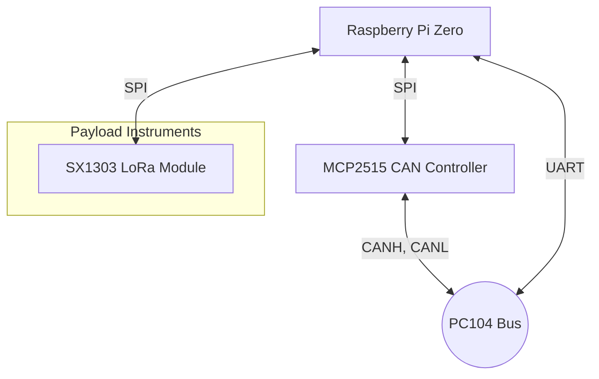

# Payload Subsystem

## Overview
The Payload subsystem carries the primary mission instruments of the CubeSat. For TUSat, the payload focuses on advanced communication experiments or data relay, primarily utilizing a LoRa transceiver controlled by a Single Board Computer (SBC).

## Core Components
- **Payload SBC**: Raspberry Pi Zero
  - Provides a high-level Linux environment to process payload data, run custom mission scripts, and interface with the LoRa network.

## Sensors and Modules

### Mission Payload
- **LoRa Module (SX1303)**:
  - **Duty**: Acts as the primary mission instrument, providing a LoRa gateway or advanced transceiver capabilities for Internet of Things (IoT) data relay or long-range experiments.
  - **Interface/Protocol**: SPI (MISO, MOSI, SCK, CS) connected to Raspberry Pi's GPIO pins, along with extra control lines like POWER EN and RESET HOST.

### Internal Bus Communication
- **CAN Transceiver (MCP2515)**:
  - **Duty**: Enables the Raspberry Pi Zero to communicate with the rest of the satellite over the PC104 CAN bus. Since the Pi Zero lacks native CAN hardware, this standalone CAN controller provides the interface.
  - **Interface/Protocol**: SPI (MISO, MOSI, SCK, CS) connected to the Raspberry Pi. The transceiver then outputs standard CANH and CANL lines.
- **PC104 Bus**:
  - The Raspberry Pi interfaces directly with the OBC via UART (OBC TX/RX) and shares the CAN bus for broader system telemetry and control.

## Architecture Diagram

### Detailed Pinout Diagram
